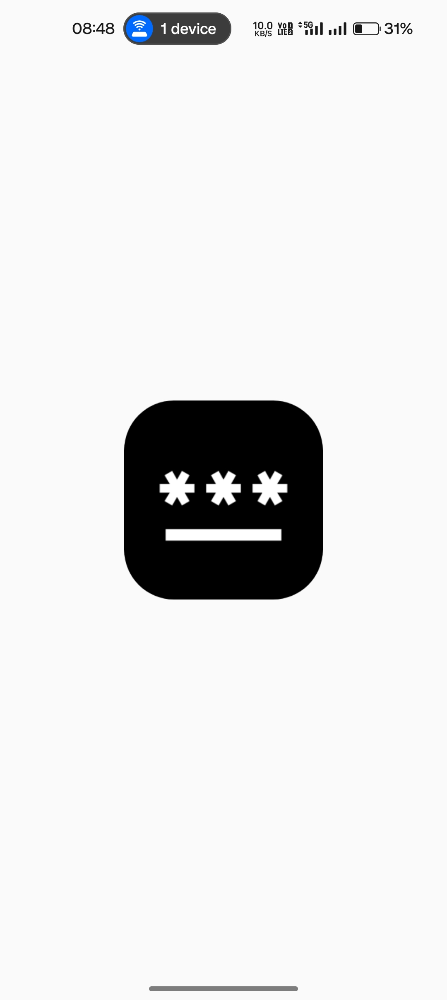
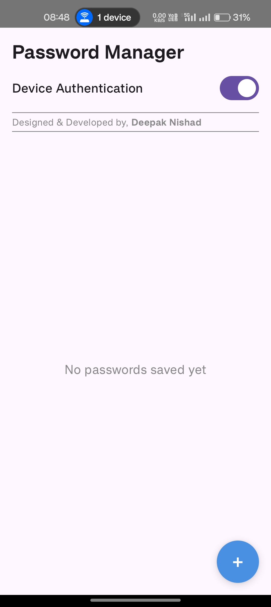
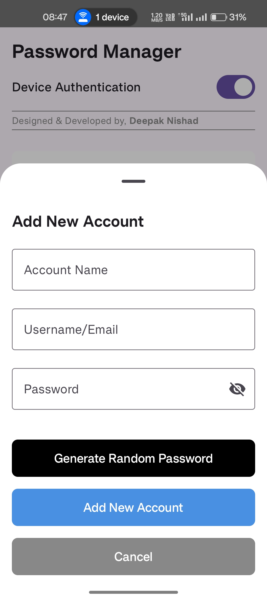
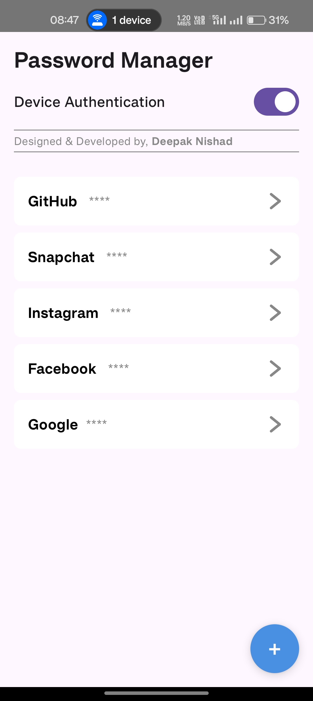
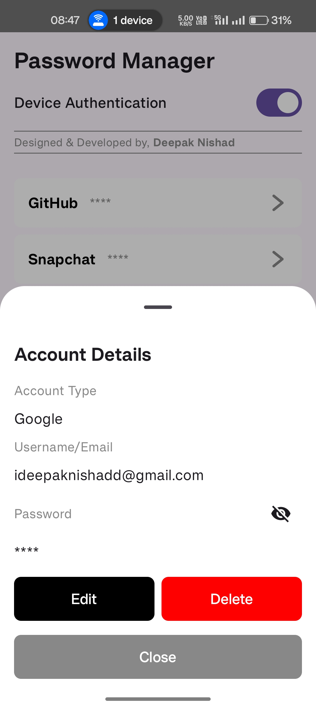
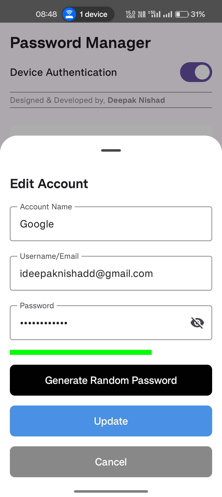

# 🔐 Password Manager App

## 📝 Overview
A secure password manager application built with Jetpack Compose and Kotlin, designed to store and manage credentials locally with robust security features. The app leverages modern Android architecture components and provides a user-friendly interface for password management.

## ✨ Features
- **📋 Add, View, Edit, and Delete Passwords**: Use intuitive bottom sheet dialogs for all password operations.
- **🔒 Secure Encryption**: Passwords are encrypted using AES with the Android Keystore for enhanced security.
- **💾 Room Database**: Local storage of credentials using Room for efficient and reliable data persistence.
- **👆 Device Authentication**: Supports fingerprint, PIN, pattern, and password authentication for secure app access.
- **📊 Password Strength Meter**: Visual indicator to assess password strength during creation or editing.
- **🎲 Password Generation**: Generate strong, random passwords within the app.
- **👁️ Toggle Password Visibility**: Show or hide passwords in add/edit and details screens for user convenience.
- **🎨 Modern UI**: Built with Jetpack Compose for a responsive and dynamic interface.
- **🏗️ MVVM Architecture**: Clean separation of concerns for maintainability and testability.
- **⚡ Kotlin Coroutines and Flow**: Reactive data updates for seamless UI performance.

## 📱 Requirements
- **🤖 Android SDK**: API 23 (Marshmallow) or higher
- **📐 Kotlin**: Version 1.9.0 or later
- **🧩 Jetpack Compose**: For declarative UI
- **🗄️ Room Database**: For local data storage
- **📚 AndroidX Libraries**: Including Biometric, DataStore, and Lifecycle components
- **🛠️ Android Studio**: Arctic Fox (2020.3.1) or later for optimal compatibility

## 📥 Installation
1. **📂 Clone the repository**:
   ```bash
   git clone https://github.com/ideepaknishadd/PasswordManager.git
   ```
2. **📱 Open the project** in Android Studio.
3. **🔄 Sync the project** with Gradle to download dependencies.
4. **▶️ Build and run** the app on an emulator or physical device (API 23+).

## 🔍 Usage
1. **🚀 Launch the App**: View the splash screen, then authenticate using fingerprint, PIN, pattern, or password if "Device Authentication" is enabled (default).
2. **🏠 Home Screen**: View the list of saved passwords. If no passwords are saved, a centered "No passwords saved yet" message appears.
3. **➕ Add Password**: Click the Floating Action Button (FAB) to open the Add Dialog and create a new password.
4. **👀 View Details**: Click a password in the list to open the Password Details Bottom Sheet, showing account type, username, and password.
5. **✏️ Edit or Delete**: In the Password Details Bottom Sheet, edit the password (opens Edit Dialog) or delete it (opens Delete Dialog).
6. **👁️ Toggle Visibility**: In Add/Edit and Password Details screens, toggle password visibility to show or hide the password.
7. **🔐 Device Authentication Toggle**: In the Home Screen's top bar, enable/disable authentication using the "Device Authentication" switch.

## 📸 Screenshots

Below are screenshots of the app's key screens.

### 1. 🏁 Splash Screen
- **Description**: Displays the app's splash screen on launch, introducing the Password Manager.
<div align="center">
  
</div>

### 2. 🔒 Authentication Prompt
- **Description**: Shows the system-provided authentication prompt when the app launches, if "Device Authentication" is enabled. Supports fingerprint, or device credentials (PIN, pattern, password).
- **Screenshot**: Not included as Appearance varies by Android version and device.

### 3. 🏠 Home Screen (Empty)
- **Description**: Displays "No passwords saved yet" centered on the screen when no passwords are stored. Includes a top bar with "Password Manager" title and "Device Authentication" toggle, and a FAB.
<div align="center">
  
</div>

### 4. ➕ Add Dialog
- **Description**: A bottom sheet for adding passwords, with fields for account type, username, and password, a password strength meter, a generate password button, and a toggle for password visibility.
<div align="center">
  
</div>

### 5. 📋 Home Screen (With Data)
- **Description**: Shows the password list in a `LazyColumn` with `PasswordItem` cards (bold account name, "****", gray arrow icon). Includes the top bar and FAB.
<div align="center">
  
</div>

### 6. 🔍 Password Details
- **Description**: A bottom sheet showing details of a selected password (account type, username, password) with buttons to edit or delete, and a toggle for password visibility.
<div align="center">
  
</div>

### 7. ✏️ Edit Dialog
- **Description**: A bottom sheet for editing passwords, pre-filled with existing data, including fields for account type, username, and password, a password strength meter, a generate password button, and a toggle for password visibility.
<div align="center">
  
</div>

### 8. 🗑️ Delete Dialog
- **Description**: A confirmation bottom sheet for deleting a password, showing "Confirm Deletion" and "Are you sure you want to delete the account '[accountType]'?" with "Yes, Delete" and "Cancel" buttons.
<div align="center">
  
</div>

## 👨‍💻 Developer Information
- **👤 Developer**: Deepak Nishad
- **📂 GitHub**: [github.com/ideepaknishadd](https://github.com/ideepaknishadd)
- **📞 Contact**: +916351387915
- **📧 Email**: [ideepaknishadd@gmail.com](mailto:ideepaknishadd@gmail.com)

## 🤝 Contributing
This is an open-source project, and contributions are welcome! To contribute:
- 🍴 Fork the repository
- 🌿 Create a feature branch (`git checkout -b feature/YourFeature`)
- 💾 Commit changes (`git commit -m "Add YourFeature"`)
- 📤 Push to the branch (`git push origin feature/YourFeature`)
- 🔍 Open a Pull Request

Please follow the project's Kotlin and Jetpack Compose conventions.

## 📜 License
This project is licensed under the MIT License. See the [LICENSE](LICENSE) file for details.

---

**Engineered with ❤️ by Deepak Nishad**
